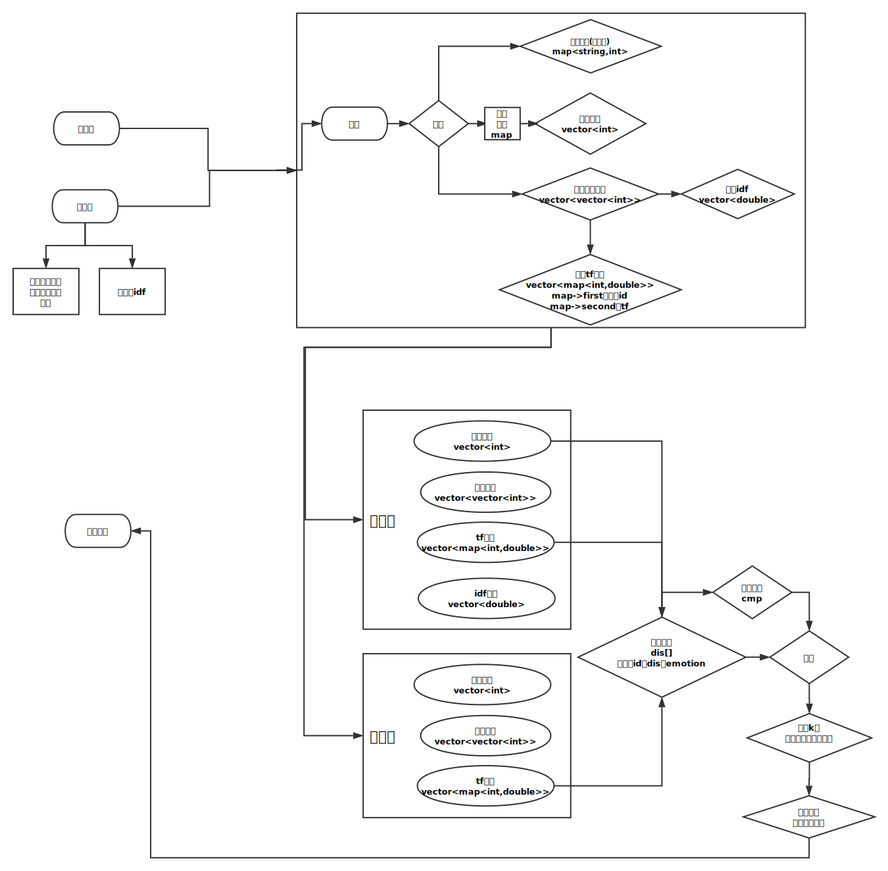
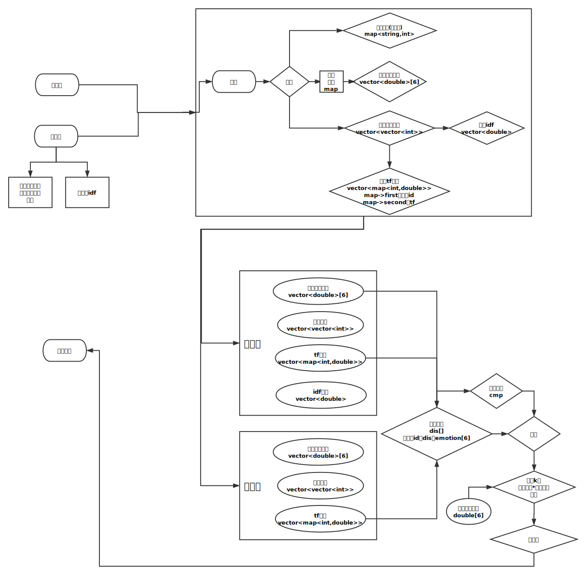
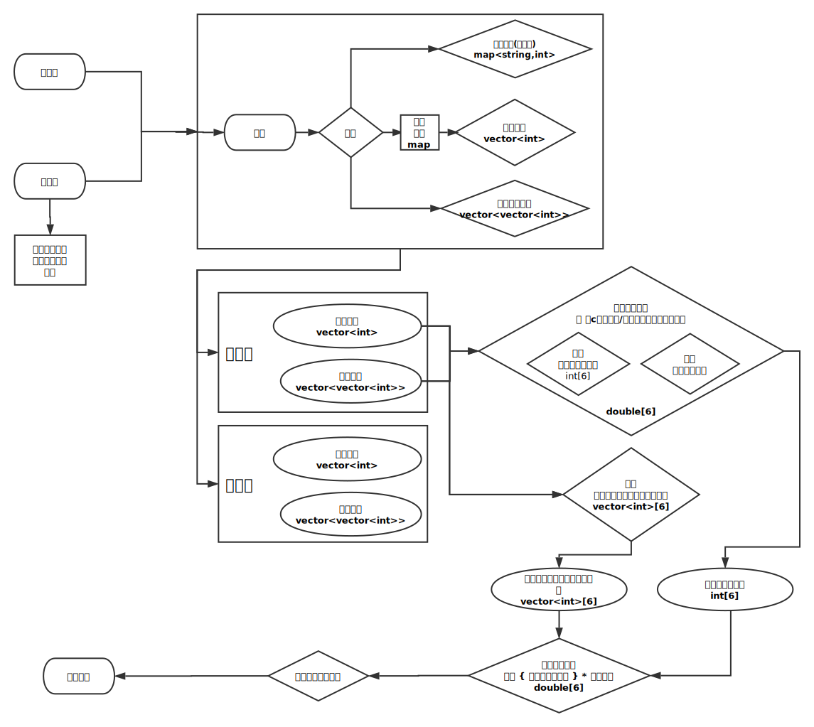
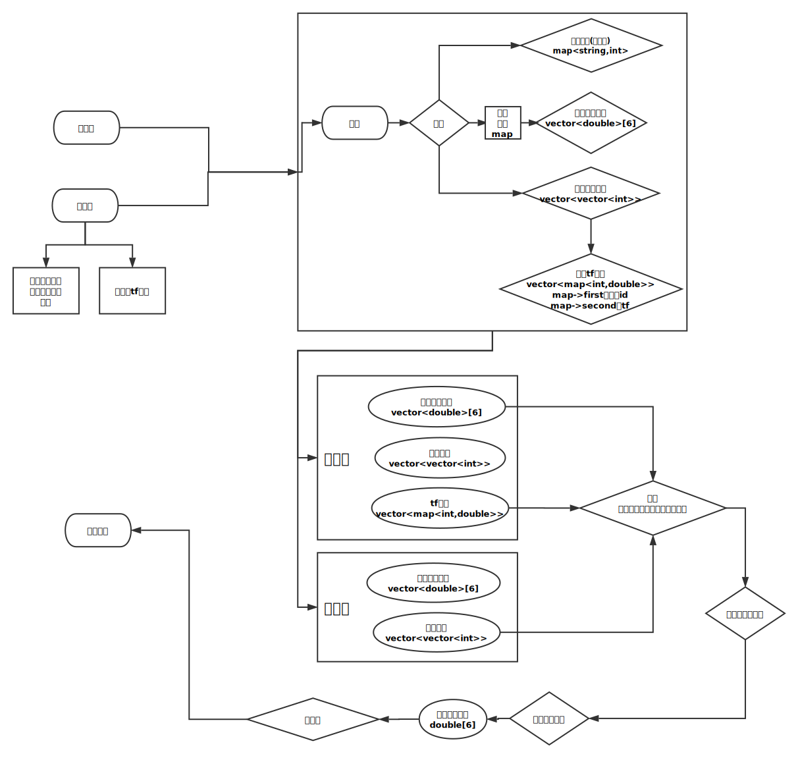
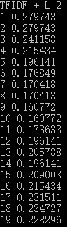
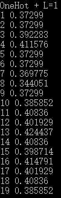
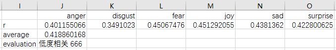
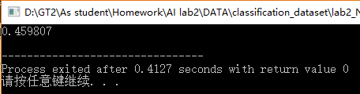
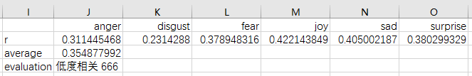

<center><font size=6em>**中山大学移动信息工程学院本科生实验报告**</font></center>

<center><font size=5em>**（2017年秋季学期）**</font></center>

**课程名称：人工智能**

------

| **年级** | **专业方向** |  **学号**  | **姓名** |
| :----: | :------: | :------: | :----: |
|  1501  | 移动（互联网）  | 15352005 |  蔡景韬   |

------

### 一、实验题目

+ K近邻与朴素贝叶斯——分类和回归

### 二、实验内容

#### 1. 算法原理

- **有监督的机器学习模型**

  + 给出带标签的训练数据
  + 用训练数据训练模型至一定程度
  + 用训练好的模型预测不带标签的数据的标签
  + 本实验中的KNN与NB都属于有监督的机器学习模型

- **分类问题（预测离散值问题）**

     - **KNN分类**

          - 在*k-NN*分类中，一个对象的分类是由其邻居的“多数表决”确定的，*k*个最近邻居（*k*为正整数，通常较小）中最常见的分类决定了赋予该对象的类别（若*k* = 1，则该对象的类别直接由最近的一个节点赋予）。

          - KNN算法本身简单有效，它是一种 lazy-learning 算法

          - KNN 分类的计算复杂度和训练集中的文档数目成正比（如果训练集中文档总数为n，则KNN的分类时间为O(n)）

          - 影响KNN分类准确性的要素主要有以下几个：

               1. K值的选择

                  a)  K值较小意味着只有与输入实例较近的训练实例才会对预测结果起作用，但容易发生过拟合；

                  b)  如果 K 值较大，优点是可以减少学习的估计误差，但缺点是学习的近似误差增大，这时与输入实例较远的训练实例也会对预测起作用，使预测发生错误。

                  c)  在本次实验中，使用遍历K取值的方法对K值进行调优。（遍历范围：1 -$\sqrt{N}$，N为训练集实例）

                  d)  （参阅资料知）随着训练实例数目趋向于无穷和 K=1 时，KNN分类误差率不会超过贝叶斯误差率的2倍，如果K也趋向于无穷，则误差率趋向于贝叶斯误差率。

               2. 分类决策规则

                  a)  KNN分类的决策规则是多数表决，即由输入实例的 K 个最临近的训练实例中的多数类决定输入实例的类别

                  b)   本次实验中，当多数类存在多个时的分类决策对算法的结果产生的影响也比较明显。

               3. 距离度量

                  常见的距离度量有：曼哈顿距离、欧式距离（最常见）、余弦相似度

               4. 其他

                  a)  在文本分析中，使用OneHot矩阵还是TF-IDF矩阵对KNN分类结果也会产生巨大影响。一般来说TF-IDF矩阵会优于OneHot矩阵，个人理解是因为TF-IDF所包含的信息大于OneHot矩阵，且引进了IDF的概念，对文本的识别具有积极作用。

                  b)  对权值进行归一化

                  ​      在度量之前，应该将每个属性的值规范化，这样有助于防止具有较大初始值域的属性比具有较小初始值域的属性的权重过大。

          - “多数表决”分类会在类别分布偏斜时出现缺陷。

               出现频率较多的样本将会主导测试点的预测结果，因为他们比较大可能出现在测试点的K邻域而测试点的属性又是通过*k*邻域内的样本计算出来的。

               解决这个缺点的方法之一是在进行分类时将样本到*k*个近邻点的距离考虑进去。

     - **NB分类**

          - NB分类器基于贝叶斯公式：$P(A , B) = P(A | B) * P(B)$

          - NB分类器还基于一个假定：给定目标值时属性之间相互条件独立（即$P(A , B) = P(A) * P(B)$ ）。

          - NB分类器常见有两种模型

               1. 多项式模型(multinomial model)

                  计算P( 词 | 感情 )时，使用“词袋”的方式，即将某种感情的所有词放入一个“词袋”中（允许重复）：

                  ​	<biger>$某个词的概率 = \frac{该词在词袋中出现的次数 }{ 词袋总词数 }$</biger>

               2. 伯努利模型(Bernoulli model)

                  计算P( 词 | 感情 )时，选择某种感情的所有文本序列，以文本为单位，计算出现某个词的文本数：

                  ​	<biger>$某个词的概率 = \frac{出现该词的文本数 }{ 某种感情的文本数 }$</biger>

          - 本次实验只使用多项式模型

          - 根据上文分析，则NB分类算法可写成

               先验概率 $P(c)= 类c下词总数/整个训练样本的词总数$

               词类条件概率$P(t_k | c)=(类c下词t_k中出现的次数之和)/(类c下词总数)$

               文本类条件概率（基于假定）$P(d | c) = P(t_1,t_2...t_n | c)=P(t_1 | c)*P(t_2 | c)*...P(t_n | c)$

               后验概率 $P(d , c) = P(d | c) * P(c)$

               **最后根据后验概率，取最大概率的类作为文本预测结果即可**

          - 在基于假定，求取$P(d | c) $时，当词$t_1$不在类c下时，连乘会导致$P(d | c) =0$，这明显是我们所不希望的。

               于是使用拉普拉斯平滑（又叫加性平滑）

               顾名思义，该方法在分子加上一个固定的值a（一般为1），又根据概率和为1（$p = \sum_{k=1}^NP(t_k|c)=1$），易证：如果在分子加上1，则需要在分母加上词汇量数（不重复）

               于是词类条件概率重写为

               $P(t_k | c)=(类c下词t_k中出现的次数之和+1)/(类c下词总数+|V|)$

          - NB分类准确性的主要影响因素：平滑系数a的取值

- **回归问题（预测连续值问题）**

     - **KNN回归**

          - **KNN**也适用于连续变量估计，通过找出一个样本的k个最近邻居，将这些邻居的属性的平均值赋给该样本，就可以得到该样本的属性。

          - 更科学的方法是将不同距离的邻居对该样本产生的影响给予不同的权值(weight)，如权值与距离成反比。

          - 该算法在分类时有个主要的不足是，当样本不平衡时，有可能导致当输入一个新样本时，该样本的K个邻居中大容量类的样本占多数（等同于上文**KNN分类**中“多数表决”的缺点）。可以采用权值的方法（和该样本距离小的邻居权值大）来改进。

          - 根据上文分析，得到概率为

               $P( test\ is happy ) = \frac{train_1's\ happy\ probability}{d(train_1,test)} + \frac{train_2's\ happy\ probability}{d(train_2,test)}+...$

          - 由于对于验证集的结果进行相关度计算衡量结果，所以对于情感得出的概率需要归一化（即六种感情概率和为1）

     - **NB回归**

          - 由于网上查不到关于NB做回归的算法，于是只参考**实验指导文档**
          - 文本$X_k=\{x_1,x_2..x_n\}$是某种感情$c$的概率为$\sum_{j=1}^{N}p(x_1,d_j)p(x_2,d_j)...p(x_n,d_j)p(d_j,c)$
          - 当词$x_k$不在训练集文本$d_j$时，连乘会导致某个概率为0，这明显是我们所不希望的。同样使用拉普拉斯平滑，在每个概率的分子加1，同样为了满足概率和为1，于是在分母加上训练集文本$d_j$的词汇数（不重复）
          - 由于对于验证集的结果进行相关度计算衡量结果，所以对于情感得出的概率需要归一化（即六种感情概率和为1）


#### 2. 伪代码（图为矢量图，为了篇幅较小，直接放大即可）

- **KNN分类**

  <center></center>


- **KNN回归**

  <center></center>

- **NB分类**

  <center></center>

- **NB回归**

  <center></center>

#### 3. 关键代码截图

- **KNN分类**

  + **读入文本（以训练集为例）**

  ```c++
  void Train(){
  	fstream file("train_set.csv",ios::in) ;
  	string str ;
  	getline(file,str) ; // 第一行舍弃
  	while ( !file.eof() ){
  		vector<int> tmp ; // 临时vector
  		map<int,double> tf ; // 临时map储存tf 
  		getline(file,str) ; // 读入一行
  		int pos = str.find(",") ; // 分割词语与标签
  		if(pos==-1) break ; // 去掉最后的换行
  		// 将前面的词语全部导入sstream
  		stringstream ss(str.substr(0,pos)) ; 
  		// 将标签记录到全局变量train_label，其中使用映射将string映射为int
        	train_label.push_back( emotionMap[ str.substr(pos+1) ] ) ;
  		// 分割单词
  		while ( !ss.eof() ){
  			ss >> str ;
  			if ( !Words.count(str) ) // 如果不在词单中
                	// 插入词单，词单为全局变量map<string,int>
  				Words.insert( pair<string,int>(str,Words.size()) ) ;
  			// 同时压入临时vector，以便生成文本矩阵，其中使用词单，将string映射为int
            	tmp.push_back(Words[str]) ;
  		}
        	// 计算tf矩阵
  		double unit = (double)1/(double)tmp.size() ; // 如果出现一次的概率
  		for ( int i=0 ; i<tmp.size() ; i++ )
  			tf[tmp[i]] += unit ; // 如果出现一次，就加上一次概率
  		train.push_back(tmp) ; // 将生成的临vector压入文本矩阵train（全局变量）
  		train_tf.push_back(tf) ; // 将生成的临时tf矩阵压入tf矩阵（全局变量）
  	}
  	TrainRow = train.size() ; // 得到训练集的总行数（全局变量）
  	WordsCol = Words.size() ; // 得到词单的总数（不重复）（全局变量）
  	// 计算idf矩阵
    	for ( int i=0 ; i<WordsCol ; i++ ){ 
  		int cnt=0 ;
  		for ( int j=0 ; j<TrainRow ; j++ )
  			if ( train_tf[j].count(i) ) // 使用map的count()函数
  				cnt++ ; 
  		train_idf.push_back((double)log((double)TrainRow/(double)++cnt)) ;
  	}
  }
  ```
  - **KNN分类算法（以OneHot矩阵、曼哈顿距离为例）**

  ```c++
  // 距离的结构体
  struct D{ 
  	int id ; // 距离的来源（训练集哪一行）
  	double dis ; 
  	int emotion ; // 记录距离来源的标签感情
  	D():id(-1),dis(0),emotion(-1){}
  };
  // 定义结构体D的比较函数，sort()函数调用
  bool cmp(const D &a,const D &b){
  	if ( a.dis!=b.dis ) return a.dis < b.dis ;
  	return a.id < b.id ;
  }
  // Knn算法（使用曼哈顿距离）（对于OneHot，使用曼哈顿距离或欧式距离没有差别）
  int Knn_OneHot(int knn){ // 传入K值 
    	// 返回正确个数
  	int Right = 0 ;
  	// 计算
  	for ( int row=0 ; row<TestRow ; row++ ){ // 遍历test集所有行
  		D dis[TrainRow] ; // 训练集每一行和验证集某一行的距离
  		for ( int i=0 ; i<TrainRow ; i++ ){
  			dis[i].id = i ; // 记录id（训练集哪一行）
  			dis[i].emotion = train_label[i] ; // 记录感情标签
  			map<int,double>::iterator 
                						it = test_tf[row].begin(),
            							end = test_tf[row].end(),
            							tit = train_tf[i].begin(),
            							tend = train_tf[i].end() ;
  			for ( ; it!=end&&tit!=tend ; ){ // 用tf矩阵（map）实现OneHot矩阵的计算
  				int a=it->first,b=tit->first ;
               	 // 如果test的词在词单中位置先于train的词，则距离++，并推进test的迭代器
  				if ( a<b ) dis[i].dis++,it++ ; 
                	// 如果test的词在词单中位置等于train的词位置，则距离为0，同时推进迭代器
  				else if ( a==b ) it++,tit++ ;
                	// 如果test的词在词单中文字后于train的词位置，则距离++，并推进train的迭代器
  				else if ( a>b ) dis[i].dis++,tit++ ;
  			}
  			while ( it!=end ) dis[i].dis++,it++ ;
  			while ( tit!=tend ) dis[i].dis++,tit++ ;
  		}
  		sort(dis,dis+TrainRow,cmp) ; // 使用sort()，调用定义的比较函数cmp
  		// 取出前K个训练集文本，记录各个感情的计数
  		int emClass[6]={0} ;
  		for ( int k=0 ; k<knn ; k++ ){
  			emClass[dis[k].emotion] ++ ;
  		}
  		// 取众数与决策原则（当存在多个众数时的决策）
  		int emo=dis[0].emotion ; // 初始化为距离最近的文本
  		int MaxCnt=emClass[emo] ; 
          // 更新emo的前提为，前K个文本中，某个文本感情标签的计数更大
  		for ( int i=0 ; i<knn ; i++ ){
  			if ( emClass[ dis[i].emotion ] > MaxCnt ){ 
  				emo = dis[i].emotion ;
  				MaxCnt = emClass[emo] ;
  			}
  		}
  		// 如果预测的感情等于验证集的标签，则正确个数++
  		if ( emo==test_label[row] ) Right++ ;
  	}
  	return Right ;
  }
  ```

- **KNN回归**

  - **读入文本（以训练集为例）**

  ```c++
  void Train(){
  	fstream file("train_set.csv",ios::in) ;
  	string str ; char ch ; // 读入情感概率的逗号 
    	double prob ;
  	getline(file,str) ; // 舍弃第一行
  	while ( !file.eof() ){
  		vector<int> tmp ; // 临时vector
  		map<int,double> tf ; // 临时tf矩阵
  		getline(file,str) ;
  		int pos = str.find(",") ; // 返回第一个逗号的位置，分割词语与情感概率
  		if(pos==-1) break ;
  		// 将前面的词语与概率导入sstream，便于分开单个词与感情概率
  		stringstream ss(str.substr(0,pos)),ss2(str.substr(pos)) ;
        	for ( int i=0 ; i<6 ; i++ ){
  			ss2 >> ch >> prob ; // 读入舍弃逗号，并把概率读入prob
  			train_prob[i].push_back(prob) ; // 将得到的prob压入train_prob（全局变量）
  		}
  		while ( !ss.eof() ){
  			ss >> str ;
  			if ( !Words.count(str) ) // 如果不在词单中
  				Words.insert( pair<string,int>(str,Words.size()) ) ;
  			tmp.push_back(Words[str]) ; // 将词id压入临时vector中
  		}
  		double unit = (double)1/(double)tmp.size() ;
  		for ( int i=0 ; i<tmp.size() ; i++ ) // 计算tf矩阵
  			tf[tmp[i]] += unit ;
  		train.push_back(tmp) ; // 将临时vector压入文本矩阵train（全局变量）
  		train_tf.push_back(tf) ; // 将临时tf矩阵压入tf矩阵（全局变量）
  	}	TrainRow = train.size() ; // 记录训练集总行数（文本数）
  	WordsCol = Words.size() ; // 记录词单大小（不重复）
  	for ( int i=0 ; i<WordsCol ; i++ ){ // 计算idf矩阵
  		int cnt=0 ;
  		for ( int j=0 ; j<TrainRow ; j++ )
  			if ( train_tf[j].count(i) )
  				cnt++ ;
  		train_idf.push_back((double)log((double)TrainRow/(double)(cnt+1))) ;
  	}
  }
  ```

    - **KNN回归算法（以TFIDF矩阵与余弦相似度为例）**

  ```c++
  // 距离结构体
  struct D{
  	int id ; // 距离来源的文本id（训练集哪一行）
  	double dis ; // 距离
  	double emotion[6] ; // 距离来源的文本感情概率
  	D():id(-1),dis(0){ memset(emotion,0,sizeof emotion); }
  };
  // 由于相似度越大，与文本越相似，跟距离的比较函数正好相反
  bool cmp2(const D &a,const D &b){
  	if ( a.dis!=b.dis ) return a.dis > b.dis ;
  	return a.id < b.id ;
  }
  // KNN算法
  void Knn_TFIDF(int knn){
  	// 不同K值输出到不同path的文件
  	fstream file(path[knn-1].c_str(),ios::out) ;
  	for ( int row=0 ; row<TestRow ; row++ ){ // 遍历验证集的每一个文本（每一行）
  		D dis[TrainRow] ;
  		for ( int i=0 ; i<TrainRow ; i++ ){
  			dis[i].id = i ; // 记录训练集文本id
  			for ( int j=0 ; j<6 ; j++ ) // 记录训练集文本感情概率
  				dis[i].emotion[j] = train_prob[j][i] ;
  			
  			map<int,double>::iterator 
                						it = test_tf[row].begin(),
          							end = test_tf[row].end(),
          							tit = train_tf[i].begin(),
          							tend = train_tf[i].end() ;
  			for ( ; it!=end ; it++ )
  				if ( train_tf[i].count(it->first))
                  	// 使用 TFIDF矩阵 计算，求余弦相似度的分子部分
  					dis[i].dis += (double)it->second*train_idf[it->first] 
                      			 * train_tf[i][it->first]*train_idf[it->first] ;
  			// 计算|A|^2与|B|^2
          	double tmp1=0,tmp2=0 ;
  			for ( it=test_tf[row].begin() ; it!=end ; it++ )
  				tmp1 += pow(it->second*train_idf[it->first],2) ;
  			for ( ; tit!=tend ; tit++ )
  				tmp2 += pow(tit->second*train_idf[tit->first],2) ;
          	// 求余弦相似度（为了防止分子为0，在乘积加上0.001）
  			dis[i].dis = (double)(dis[i].dis+0.001)/(double)sqrt(tmp1*tmp2) ;
  		}
  		sort(dis,dis+TrainRow,cmp2) ; // 余弦相似度按照降序排列
  		
  		double prob[6],sum=0 ;
  		memset(prob,0,sizeof prob) ;
  		for ( int i=0 ; i<6 ; i++ ){
  			for ( int k=0 ; k<knn ; k++ ) // 取前K个文本，感情概率与相似度乘积求和
  				prob[i] += (double)train_prob[i][dis[k].id]
              			  *(double)(dis[k].dis) ;
  			sum += prob[i] ; // 求和，以便归一化
  		}
  		for ( int i=0 ; i<6 ; i++ ) // 归一化
  			prob[i] /= sum ;
  		for ( int i=0 ; i<6 ; i++ ) // 输出
  			file << prob[i] << "\t" ;
  		file << endl ;	
  	}
  }
  ```

-  **NB分类**

  - **文本输入（以训练集为例）**

  ```c++
  void Train(){
  	fstream file("train_set.csv",ios::in) ;
  	string str ;
  	getline(file,str) ; // 舍弃第一行
  	while ( !file.eof() ){
  		vector<int> tmp ; // 临时vector
  		getline(file,str) ;
  		int pos = str.find(",") ; // 切分词语与感情
  		if(pos==-1) break ;
  		// 将词语压入sstream，以便切分单个词
  		stringstream ss(str.substr(0,pos)) ;
        	// 记录感情
  		train_label.push_back( emotionMap[ str.substr(pos+1) ] ) ;
  		while ( !ss.eof() ){
  			ss >> str ;
  			if ( !Words.count(str) ) // 如果单词步在词单中
  				Words.insert( pair<string,int>(str,Words.size()) ) ;
  			tmp.push_back(Words[str]) ; // 将单词压入临时vector中
  		}
  		train.push_back(tmp) ; // 将临时vector压入训练集文本矩阵
  	}
  	TrainRow = train.size() ; // 得到训练集总行数（文本数）
  	WordsCol = Words.size() ; // 得到词单总数（不重复）
  } 
  ```

  - **计算先验概率**

  ```c++
  void PriorProb(){
  	memset(EmoCnt,0,sizeof EmoCnt) ;
  	for ( int i=0 ; i<TrainRow ; i++ ){ 
  		EmoCnt[train_label[i]] += train[i].size() ; // 某类感情的单词总数(全局)(允许重复)
  		WordSum += train[i].size() ; // 文本单词总数(全局)(允许重复)
  	}
  	for ( int i=0 ; i<6 ; i++ ) // 计算先验概率 = 某类单词数/文本单词总数
  		EmoPriorProb[i] = (double)EmoCnt[i]/(double)WordSum ;
  }
  ```

  - **计算某种感情下某词总数**

  ```c++
  void WordCnt(){
  	// 初始化vector<int>，扩充到词单长度
  	for ( int i=0 ; i<6 ; i++ )
  		for ( int j=0 ; j<WordsCol ; j++ )
  			WordCntInEmo[i].push_back(0) ;
    	// 计算某种感情下某词总数
  	for ( int i=0 ; i<TrainRow ; i++ )
  		for ( int j=0 ; j<train[i].size() ; j++ )
  			WordCntInEmo[ train_label[i] ][train[i][j]] ++ ;
  }
  ```

  - **NB分类算法**

  ```c++
  int Mulitnomial(){ 
  	int Right = 0 ; // 预测正确个数
  	for ( int row=0 ; row<TestRow ; row++ ){ // 遍历验证集的每一个文本（每一行）
  		double Emo[6] ;
  		for ( int i=0 ; i<6 ; i++ ) // 初始化感情概率，不能用memset！
  			Emo[i] = 1 ;
  		for ( int emo=0 ; emo<6 ; emo++ ){
            	// 计算条件概率 = (某感情下某词总数+1)/(某感情单词总数+词单总数)
  			for ( int j=0 ; j<test[row].size() ; j++ )
  					Emo[emo] *= (double)(WordCntInEmo[emo][ test[row][j] ]+1)
                				   	/(double)(EmoCnt[emo]+WordsCol) ;
            	// 计算后验概率 = 条件概率*先验概率
  			Emo[emo] *= EmoPriorProb[emo] ;
  		}
        	// 取概率最大的感情作为预测的结果
  		double value = -1 ;
  		int emo=-1 ;
  		for ( int i=0 ; i<6 ; i++ ){
  			if ( Emo[i]>value ){
  				value = Emo[i] ;
  				emo = i ;
  			}
  		}
  		if ( emo==test_label[row] ) Right++ ;
  	}
  	return Right ;
  }
  ```

- **NB回归**

  - **读入文本（以训练集为例）**

  ```c++
  void Train(){
  	fstream file("train_set.csv",ios::in) ;
  	string str ; char ch ;
  	double prob ;
  	getline(file,str) ;
  	while ( !file.eof() ){
  		vector<int> tmp ; // 临时vector
  		getline(file,str) ;
  		int pos = str.find(",") ; // 切分词语与感情
  		if(pos==-1) break ;
  		stringstream ss(str.substr(0,pos)),ss2(str.substr(pos)) ;
  		for ( int i=0 ; i<6 ; i++ ){ // 记录感情
  			ss2 >> ch >> prob ;
  			train_prob[i].push_back(prob) ;
  		}
  		while ( !ss.eof() ){
  			ss >> str ;
  			if ( !Words.count(str) ){
  				Words.insert( pair<string,int>(str,Words.size()) ) ;
  				words.push_back(str) ;
  			}
  			tmp.push_back(Words[str]) ;
  		}
  		train.push_back(tmp) ;
  	}
  	TrainRow = train.size() ;
  	WordsCol = Words.size() ;
  	// 求拉普拉斯后的TF矩阵
  	for ( int i=0 ; i<TrainRow ; i++ ){
  		map<int,double> tf ;
  		for ( int j=0 ; j<train[i].size() ; j++ )
  			tf[train[i][j]] ++ ;
        	// 拉普拉斯平滑：(xi+a)/(N+a*d)
        	// xi是某个单词出现的次数，a可以取1
        	// N是train某一行的词个数（允许重复），d是train某一行的词个数（不重复）
  		for ( map<int,double>::iterator it=tf.begin() ; it!=tf.end() ; it++ )
  			it->second = (double)(it->second+a)
            				/(double)(train[i].size()+a*tf.size()) ;
  		train_tf.push_back(tf) ;
  	}
  }
  ```

  - **NB回归算法**

  ```c++
  void Laplace(){ 
  	fstream file("answer.txt",ios::out) ;
  	for ( int row=0 ; row<TestRow ; row++ ){
  		double prob[6],sum=0 ;
  		for ( int i=0 ; i<6 ; i++ ) // 初始化感情概率
  			prob[i] = 0 ;
  		for ( int emo=0 ; emo<6 ; emo++ ){
  			for ( int i=0 ; i<TrainRow ; i++ ){
  				double res=1 ;
  				for ( int col=0 ; col<test[row].size() ; col++ ){
  					if ( train_tf[i][test[row][col]] ) // 连乘训练集中对应词的tf值
  						res *= train_tf[i][test[row][col]] ;
  					else // 如果对应词tf为0，则同样进行拉普拉斯平滑
  						res *= (double)a
                        		   /(double)(train[i].size()+a*train_tf[i].size()) ;
  				}
  				res *= train_prob[emo][i] ; // 连乘结果
  				prob[emo] += res ; // 感情概率对所得求和
  			}
  			sum += prob[emo] ; // 以便归一化
  		}
  		for ( int i=0 ; i<6 ; i++ ) // 归一化
  			prob[i] /= sum ;
  		for ( int i=0 ; i<6 ; i++ )
  			file << prob[i] << "\t" ;	
  		file << endl ;	
  	}
  	file.close() ;
  }
  ```

#### 4. 创新点&优化

- 创新点
  - 使用map存储TF矩阵，每次查询较快，且可以当作OneHot矩阵使用，并无需遍历整个OneHot矩阵，减小了时间开销
- 优化
  - KNN分类时，当存在多个众数时，采用以标签中距离最近的文本为先的决策原则；最优K=13
  - KNN回归时，使用TFIDF矩阵与余弦相似度；最优K=11
  - NB分类与NB回归时，使用拉普拉斯平滑

### 三、实验结果及分析

#### 1. 实验结果展示示例（使用验证集）

- **KNN分类**

  对K遍历（K= 1 - 19）

  左图为使用TFIDF与欧式距离时，对验证集的准确率；右图为使用OneHot与曼哈顿距离时的准确率

                    

- **KNN回归**

  使用TFIDF矩阵与余弦相关度，取K=11时，对验证集的相关度

  <center></center>

- **NB分类**

  使用拉普拉斯平滑，a=1

  <center></center>

- **NB回归**

  使用拉普拉斯平滑，a=0.01

  <center></center>


####2. 评测指标展示即分析（如果实验题目有特殊要求，否则使用准确率）

- KNN分类

  当K=13时，使用OneHot矩阵与曼哈顿距离，准确率最优，为 0.424437

- KNN回归

  当K=11时，使用TFIDF矩阵与余弦相关度，相关度最优，为0.418860168

- NB分类

  使用拉普拉斯平滑，且a=1时，准确度最优，为0.459807

- NB回归

  使用拉普拉斯平滑，且a=0.01时，相关度最优，为0.354877992


### 四、思考题

#### 1.根据相似度加权，为什么使用距离的倒数作为权重？

- 为了符合，距离越近权重越大。距离越近，说明测试文本与训练文本越相似，理应让其贡献越大，即权重越大。

#### 2.同一测试样本的各个情感概率总和应该为1，如何处理？

- 每个概率都去除以其概率和即可。
- $p(a) = \frac{a}{a+b+c+d+e+f} $

#### 3. 在矩阵稀疏程度不同的时候，这两者表现有什么区别，为什么？

- 易证，曼哈顿距离增长大于欧式距离

  $x+y=\sqrt{(x+y)^2}=\sqrt{x^2+2xy+y^2}>\sqrt{x^2+y^2}$

  所以当矩阵稀疏程度较低时，曼哈顿距离的附加项很多，于是增长速度远远大于欧式距离，即较难区别文本。

#### 4.伯努利模型和多项式模型分别有什么优缺点？

- 二者的计算单位不一样，多项式模型以单词为单位，而伯努利模型以文本为单位。
- 伯努利模型简单，方便计算，但是以文本为单位意味着准确性不高
- 多项式模型以单词为单位，能更好的表示某个单词带来的感情贡献，准确性较高。但设计较为复杂，计算复杂度也高。

#### 5.如果测试集中出现了一个之前全词典中没有出现过的词该如何解决

- 如果出现一个全词典没出现过的单词，则抛弃该单词
- 原因：
  - 多出的词没有在训练集中，可以知道我们无法判断它，也不知道它对感情的相关贡献。
    - 如果不抛弃，而是直接加入词典，一来会污染词典，因为词典是基于训练集，而非验证集或测试集；
    - 二来，加入词典意味着我们“认识”该词，知道其对感情的相关贡献度，然而很明显，对于测试集与验证集，我们完全不知道其中词对情感的贡献度，所以不能加入词典
  - 将没有出现过的词抛弃后，原先有的词反而概率会增加，更易于辨别文本的类型。
  - 这也符合，当看到一句话，我们一般从认识的词看起，而忽略不认识的词。

