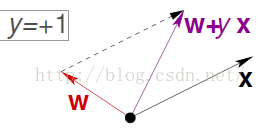
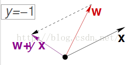
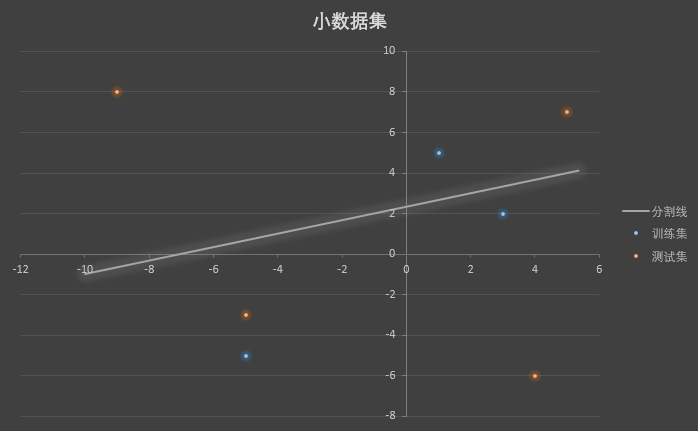
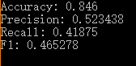
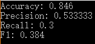

<center><font size=6em>**中山大学移动信息工程学院本科生实验报告**</font></center>

<center><font size=5em>**（2017年秋季学期）**</font></center>

**课程名称：人工智能**

------

| **年级** | **专业方向** |  **学号**  | **姓名** |
| :----: | :------: | :------: | :----: |
|  1501  | 移动（互联网）  | 15352005 |  蔡景韬   |

------

### 一、实验题目

+ 感知机学习算法 Perceptron Learning Algorithm

### 二、实验内容

#### 1. 算法原理

- PLA用于解决的是对于二维或者高维的 **线性可分 **问题的分类，最终将问题分为两类——是或者不是。

- 算法基本思路：

     - 通过训练得到权重矩阵，用以表示各列属性与结果的相关程度：

       - 权重为正，说明该属性与“是”的结果正相关，且值越大，正相关程度越大，正影响越大
       - 权重为负，说明该属性与“是”的结果负相关，且绝对值越大，负相关程度越大，负影响越大

     - 预测公式：

          - 将权重矩阵与属性值内积（相应的对属性值进行加权），并与某个阈值比较：
               - 如果大于阈值，则问题的答案是“是”
               - 如果小于阈值，则问题的答案是“不是”
          - 则上述表示可写出其表达式：$h(x)=sign((\sum_{i=1}^dW_iX_i)-threshold)$

     - 预测公式的数学处理：

          - 为了简化表达式，我们可以把阈值当作$W_0$，且对**X**矩阵多添加$X_0=1$（阈值可以当作一个属性，且每一个训练文本共用一个阈值，于是阈值属性值都是1）
          - 表达式重写为：$h(x)=sign((\sum_{i=0}^dW_iX_i))=sign(W^TX)$

     - 权重矩阵的更新

          - 思路：

               - 使用向量模型进行理解，X矩阵是一个高维的向量，权重矩阵是另一个高维向量

               - X矩阵与权重矩阵的内积的正负可以表征两个向量之间的夹角

               - 内积之后，如果出现FP，说明夹角太大了，为了靠近X向量，把权重矩阵更新为加上X向量；同理如果出现FN，说明太小了，为了靠近X向量，把权重矩阵更新为减去X向量。

          > <center>        </center>

          - 更新公式：

               - $W^{p+1}=W^p+y_iX_i$
               - 对于每一行数据样本，只要不是内积为0（两向量垂直），不断更新权重矩阵，总会得到符合该行样本的W。
          - 这种更新方法被称为梯度下降法，从数学层面可以理解为，每次都减去 成本函数的偏导乘以步长。
            - 成本函数：$Q=-W^TX_iy_n$
            - 成本函数的偏导：$\frac{\partial Q}{\partial W}=-y_iX_i $
            - 梯度下降法：$W^{p+1}=W^p-h\frac{\partial Q}{\partial W}=W^p+hy_iX_i$，取步长h为1即可得到W矩阵的更新公式

- 算法的局限性

     1. PLA的算法是局限在线性可分的训练集上的，然而我们拿到一个训练集，并不知道其到底是不是线性可分，如果不是，PLA的算法程序将无限循环下去。
        - 解决方法：指定一个较大的迭代次数，到达次数后便停止计算
     2. 即使训练集是线性可分，我们也不知道PLA什么时候才能找到一个合适的解，如果要循环很多次才能找到，这对于实际使用是开销很大的。

- 算法的细节

     - **非pocket版**
          - 如果不是线性可分，则需要设置一个迭代次数iterations
          - 更新方法：每次更新W时是否将其更新到那行数据样本计算正确为止，还是无论如何只更新一次
          - W的初始化值
          - 非pocket版的PLA算法的结果主要取决于以上三个方面
     - **pocket版**
          - 思路：pocket是找到一个权重矩阵W，使得准确率最高。pocket算法类似贪心，如果找到一个更好准确率)的W，那么就去更新pocket里储存的那个最好的W
          - 这里也有一些细节：
               - 如果不是线性可分，则需要设置一个迭代次数iterations
               - 更新方法：每次更新W时是否将其更新到那行数据样本计算正确为止，还是无论如何只更新一次
               - 更新W时，是否采用，如果更新之后准确率低于pocket，则不更新（如果采用，则结果与迭代次数无关）
          - 对于细节中的第三点，我觉得不能每次都采用最优解进行更新，因为可能会陷入局部最优而无法跳出来


#### 2. 伪代码

- **非pocket版**

  ```c++
  for: iterations
  	for: row
      	if !judge(): (X_i*W) * y_i < 0（或 while !judge()）
          	update(): W = W + y_i*X_i
  ```

- **pocket版**

  ```c++
  for: iterations
  	for: row
      	if judge(): (X_i*W) * y_i < 0（或 while !judge()）
          	update(): W = W + y_i*X_i
          	pocket_updata(): W_best = Right > Right_best ? W:W_best
  W = W_best 
  ```


#### 3. 关键代码截图

- **非pocket版**

  - 训练函数

  ```c++
  void doTrain(int iterations){
  	while ( iterations-- )
  		for ( int i=0 ; i<Row ; i++ )
  			while( !judge(i,Train) ) // 每次都更新到某一行正确为止
  				matrixPlus(i) ; // 更新W
  }
  ```

  - judge函数

  ```c++
  bool judge(int i,const vector<vector<double> >& data){
  	double sum = matrixMulti(i,data) ; // 矩阵内积
  	if ( sum==0 || (sum>0 && data[i][Col]<0) || (sum<0 && data[i][Col]>0)  )
  		return false ;
  	return true ;
  }
  ```

  - 更新W函数

  ```c++
  void matrixPlus(int i){
  	for ( int j=0 ; j<Col ; j++ ){
  		if ( Train[i][Col]>0 )
  			W[j] += Train[i][j] ;
  		else W[j] -= Train[i][j] ;	
  	}	
  }
  ```

- **pocket版本**

  - pocket结构体

  ```c++
  struct Pocket{
  	Pocket(){ right = 0 ; }
  	void update( double r ){
  		if ( r > right ){
  			w.assign(W.begin(),W.end()) ; // 更新W_best
  			right = r ;
  		}
  	} 
  	
  	vector<double> w ;
  	int right ;
  } pocket;
  ```

  - 训练函数

  ```c++
  void doTrain(int iterations){
  	while ( iterations-- )
  		for ( int i=0 ; i<Row ; i++ )
  			if( !judge(i,Train) ){
  				matrixPlus(i) ; // 更新W
  				pocket.update(Predict(Train)) ; // 更新W_best
  			}
  	W.assign(pocket.w.begin(),pocket.w.end()) ; // 将最后的W置为W_best
  }
  ```


#### 4. 创新点&优化

- 优化
  - 每次更新W时，都将其更新到那行数据样本计算正确为止
  - 初始化W时使用随机种子
  - 遍历所有迭代次数，找最优

### 三、实验结果及分析

#### 1. 实验结果展示示例（使用小数据集）

- **验证集**

  | $x_0$ | $x_1$ | $y$  |
  | ----- | ----- | ---- |
  | 1     | 5     | -1   |
  | 3     | 2     | 1    |
  | -5    | -1    | 1    |

- **测试集**

  | $x_0$ | $x_1$ | $y$  |
  | ----- | ----- | ---- |
  | 4     | -6    | 1    |
  | 5     | 7     | -1   |
  | -9    | 8     | -1   |
  | -5    | -3    | 1    |

- 算出来的W矩阵为$\begin{pmatrix}7\\1\\-3\end{pmatrix}$

- <center></center>

- 可以看出，测试集可以被成功预测出来


####2. 评测指标展示即分析（如果实验题目有特殊要求，否则使用准确率）

- **非pocket版（W全初始化为1，使用187次迭代）**

  <center></center>

- **pocket版（W全初始化为1，使用5次迭代）**

  <center></center>


### 四、思考题

#### 1.有什么其他的手段可以解决数据集非线性可分的问题？

- 使用多个PLA一起执行，取最优或权重相加进行修正（一层神经网络雏形）
- 使用梯度下降法，修改步长h，换一种w的更新方法，保证即使有错误点，但错误点对其影响最小（逻辑回归思想）
- 将数据集转化为高维矩阵（而非一维矩阵）
- 支持向量机，拟定一个容忍点，使分界线到两边的margin都最大

#### 2.请查询相关资料，解释为什么要用这四种评测指标，各自的意义是什么。

- 准确率(Accuracy)：
  - $Accuracy=\frac{TP+TN}{TP+FP+TN+FN}$
  - 准确率是指分类正确率，等于分类正确的样本数除以所有样本数
  - 准确率是一个很好很直观的评价指标，是对分类器整体上正确率的评价
  - 但是有时候准确率高并不能代表一个算法就好。比如当数据分布极不均衡，某种类别数据太少，完全错分该类别依然可以达到很高的正确率，但此时却忽视了我们关注的东西
- 精确度(Precision)
  - $Precision=\frac{TP}{TP+FP}$
  - 精确度又叫查准率
  - 精确度是针对正结果的正确率而言，我们感兴趣的结果一般为正结果，所以我们更关注的可能也是预测为正结果的样本中有多少是真正的正样本
  - 精确度，就是（找正样本）找得**对**的概率
- 召回率(Recall)
  - $Recall = \frac{TP}{TP+FN}$
  - 召回率又叫查全率
  - 召回率也是针对正结果而言，指正样本有多少被预测正确了
  - 召回率，就是（找正样本）找得有多**全**
- 调和平均率($F_a​$)
  - $F=\frac{(1+a^2)Precision*Recall}{a^2Precision+Recall}$
  - 精确度(Precision) 和召回率(Recall)是信息检索领域两个最基本的指标。
  - 精确度和召回率是互相影响的，虽然两者都高是一种期望的理想情况，然而实际中常常是精确度高、召回率就低，或者召回率低、但精确度高。所以在实际中常常需要根据具体情况做出取舍或兼顾。
  - 需要兼顾两者时就可以用$F_a$指标
  - 当精确度和召回率权重相同时，则此时a取1
