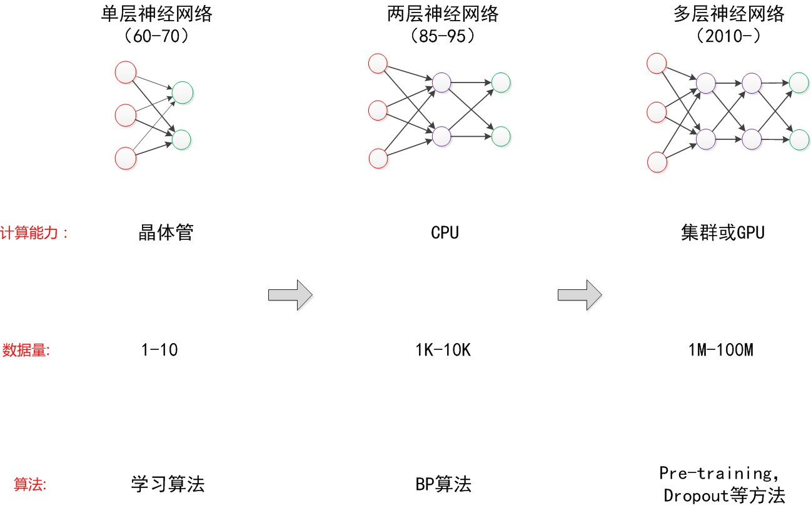

<center><font size=6em>**中山大学移动信息工程学院本科生实验报告**</font></center>

<center><font size=5em>**（2017年秋季学期）**</font></center>

**课程名称：人工智能**

------

| **年级** | **专业方向** |  **学号**  | **姓名** |
| :----: | :------: | :------: | :----: |
|  1501  | 移动（互联网）  | 15352005 |  蔡景韬   |

------

### 一、实验题目

- **Predict the use of shared bicycles ( use BPNN )**

### 二、实验内容

#### 1. 算法原理

- **人工神经网络(artificial neural network, ANN)概论**

  - 概念

    - 人工神经网络是一种模仿生物神经网络(动物的中枢神经系统，特别是大脑)的结构和功能的**计算模型**，用于对函数（数据到结果的映射函数）进行估计或近似。

    - 人工神经网络能在外界信息的基础上改变内部结构，是一种自适应系统

    - 人工神经网络分为**前馈神经网络**和**反馈神经网络**，后文与本实验介绍的都是**前馈神经网络**

      

  - 神经网络常使用监督学习进行训练，如本次实验就是使用监督学习对搭建的神经网络进行训练

    - 监督学习是指，算法是从给定的训练数据集中学习一个函数（模型），当新的数据到来时，可以根据这个函数（模型）预测结果。
    - 监督学习是训练神经网络和决策树的最常见技术
      - 神经网络和决策树技术**高度依赖**于事先确定的分类系统给出的信息，所以**对原始数据进行预处理是十分必要的**
      - 对于神经网络来说，算法通过判断网络的错误，然后调整网络去适应它
      - 对于决策树，算法通过判断哪些属性提供了最多的信息，选取最优属性进行建树

  - **神经元结构（感知机）：神经网络是由多个神经元结构组成的**

    

    - 基本思路：
      - 通过训练得到权重矩阵，用来表示各列属性对结果的贡献值
      - 训练：通过计算误差（与真实值）的梯度，使用梯度下降法对权重矩阵进行更新（牛顿迭代法的思想）
      - 预测：权重矩阵与数据矩阵进行内积（对各属性值进行加权求和），然后与阈值求差，最后通过某个非线性函数，即可得到预测结果
      - 应用：LR、PLA等

    - 应用效果：

      - 通过前面的学习，我们知道，LR、PLA等属于线性分类器，只能分类线性任务

      - 输出的结果其实就是在n维的数据平面画出一个n-1维的超平面（决策分类）进行分类（下图为当数据是2维时）

        

    - 在**PLA（感知机学习）算法**中，我们使用的非线性函数是符号函数`sgn()`，计算误差使用最小二乘法

    - 在**LR（逻辑回归）算法**中，我们使用的非线性函数是`sigmoid()`，计算误差使用加负号的似然函数

    - 在神经网络中，该非线性函数被称为**激活函数**，模拟的是生物神经元在接受一定的刺激之后产生兴奋信号，如果刺激不够的话，神经元保持抑制状态这种现象。

  - **两层神经网络（多层感知机）**

    - 为了解决感知机只能解决线性问题的局限，Minsky提出多加一层感知机计算层可以很好的解决非线性问题，这也就是本次实验BPNN的结构基础

      $\qquad \Longrightarrow \qquad $                                         

      值得注意的是，在后面两层存在一个偏置项，类比于感知机的作差阈值，于是可以重新得到结构图

      <center></center>

    - 与单层神经网络不同。理论证明，两层神经网络可以无限逼近任意连续函数。

    - 单层的神经元结构（感知机）只能做线性分类任务，而两层神经网络中的后一层也是线性分类层，应该只能做线性分类任务，为什么两个线性分类任务结合就可以做非线性分类任务呢？

      - 关键就是，从输入层到隐藏层时，数据发生了空间变换。
      - 也就是说，两层神经网络中，隐藏层对原始的数据进行了一个空间变换，使其可以被线性分类，然后输出层又划出了一个线性分类分界线，对其进行分类。

    - 这样就导出了两层神经网络可以做非线性分类的关键--隐藏层。

      - 我们知道，矩阵和向量相乘，本质上就是对向量的坐标空间进行一个变换。
      - 因此，隐藏层的参数矩阵的作用就是使得数据的原始坐标空间从线性不可分，转换成了线性可分。

    - 训练：使用**反向传播（Backpropagation，BP）算法**进行更新训练，在后文推导，这里不做详述

    - 激活函数：常使用`sigmoid()`函数

  - **多层神经网络（深度学习）**

    - 我们延续两层神经网络的方式来设计一个多层神经网络。

      

    - 多层神经网络中，输出也是按照一层一层的方式来计算：

      - 从最外面的层开始，算出所有单元的值以后，再继续计算更深一层。
      - 只有当前层所有单元的值都计算完毕以后，才会算下一层。

    - 与两层层神经网络不同，多层神经网络中的层数增加了很多。增加更多的层次有什么好处？

      - 更深入的表示特征

        - 随着网络的层数增加，每一层对于前一层次的抽象表示更深入：

          在神经网络中，每一层神经元学习到的是前一层神经元值的更抽象的表示。

        - 例如第一个隐藏层学习到的是“边缘”的特征，第二个隐藏层学习到的是由“边缘”组成的“形状”的特征，第三个隐藏层学习到的是由“形状”组成的“图案”的特征，最后的隐藏层学习到的是由“图案”组成的“目标”的特征。

        - 通过抽取更抽象的特征来对事物进行区分，从而获得更好的区分与分类能力。

      - 更强的函数模拟能力

        - 由于随着层数的增加，整个网络的参数就越多。
        - 而神经网络其实本质就是模拟特征与目标之间的真实关系函数的方法。
        - 更多的参数意味着其模拟的函数可以更加的复杂，可以有更多的容量去拟合真正的关系。

  - **神经网络的发展**

    ***

    

    ***

    

    ***

    

    ***


- **两层神经网络的预测**

  - 两层神经网络网络对给定的数据样本进行预测的方法与感知机的预测相同，只不过多计算了一层

    

  - 权重矩阵与数据矩阵进行内积（对各属性值进行加权求和），加上偏置项，然后通过某个非线性函数，即可得到隐藏层的输出结果

  - 隐藏层的输出结果与权重矩阵进行内积，然后通过某个非线性函数，即可得到预测结果

    

- **两层神经网络的训练**

  - 两层神经网络一般使用**反向传播（Backpropagation，BP）算法**训练

    - 基本思路：求取误差并通过求的其梯度，使用梯度下降法实现误差的最小化

    1. 求取误差（预测的结果与target之间的误差）

       $E=\frac12(O-target)^2$

    2. 计算误差对于每个权值的梯度

       （本实验中输出层使用的激活函数`h(x)=x`；隐藏层使用`sigmoid`函数）

       （根据高数知识易得，$sigmoid\,'(x) = sigmoid(x)*[1-sigmoid(x)]$ ）

       - 计算误差对于隐藏层 → 输出层每个权值的的梯度

       $$
       \begin{align*}
       	\frac { \partial E } { \partial W_j  } &= \frac \partial{\partial W_j} \frac12 (O-target)^2 \\
       							&=(O-target) \frac \partial{\partial W_j}O \\ 
       							&=(O-target) \frac \partial{\partial W_j}h(x_j) \quad \Longrightarrow  x_j是第j个隐藏层节点对输出层的输入\\ 
       							&=(O-target) \frac \partial{\partial W_j} x_j  \quad \quad \Longrightarrow  h'(x)=1 \\ 
       							&=(O-target) \frac \partial{\partial W_j} H_jW_j  \quad \Longrightarrow H_j是第j个隐藏层节点的输出 \\ 
       							&=(O-target)H_j
       \end{align*}
       $$

       - 计算误差对于输入层 → 隐藏层每个权值的梯度
         $$
         \begin{align*}
         	\frac { \partial E } { \partial W_{ij}  } &= \frac \partial{\partial W_{ij}} \frac12 (O-target)^2 \\
         							&=(O-target) \frac \partial{\partial W_{ij}}O \\ 
         							& \Longrightarrow 取e_o=(O-target) \\
         							&=e_o \frac \partial{\partial W_{ij}}h(x_j) \quad \Longrightarrow  x_j是第j个隐藏层节点对输出层的输入\\ 
         							&=e_o \frac \partial{\partial W_{ij}} x_j  \quad \quad \Longrightarrow  h'(x)=1 \\ 
         							&=e_o \frac \partial{\partial W_{ij}} H_jW_j  \quad \Longrightarrow H_j是第j个隐藏层节点的输出 \\ 
         							&=e_oW_j \frac \partial{\partial W_{ij}}sigmoid(x_{ij}) \Longrightarrow x_{ij}是第i个输入层节点对隐藏层j的输入 \\
         							&=e_oW_jsigmoid(x_{ij})[1-sigmoid(x_{ij})] \frac \partial{\partial W_{ij}}x_{ij} \\
         							&=e_oW_j H_j(1-H_j)\frac \partial{\partial W_{ij}}I_iW_{ij} \Longrightarrow I_i是第i个输入层节点的输出 \\
         							&=e_oW_j H_j(1-H_j)I_i
         \end{align*}
         $$

    3. 根据上文计算的梯度，使用梯度下降法（牛顿迭代的思想）对各个权值进行更新，其中$\eta$为学习率

       $W = W-\eta \nabla E$

       $\theta= \theta-\eta \nabla E$，$\theta$ 的更新与权值相同，只是输出项固定为1（即上文计算的$H_j$与$I_i$固定为1）

- **数据集的处理**

  - **机器学习中特征选择的问题**

    - 对于一个训练集，每个记录包含两部分，1是特征空间的取值，2是该记录的分类标签

    - 进行特征集选择通常使用filter，也就是衡量每个特征的重要性，然后对其进行排序，筛选的时候或者选择前N个，或者前%X。

    - 常用于衡量特征重要程度的方法，PCA/FA/LDA(linear discriminal analysis)以及卡方检测/信息增益/相关系数

    - 本次实验，我选择了使用相关系数，对原数据的15列属性与target列进行相关性计算，并从中选取了5列相关性大于0.2的属性作为输入数据

    - 相关系数

      ，其中`Cov(X,Y)`为协方差，`var[X]`为方差

      ，其中`E[X]`为X列的均值，`E[XY]`为XY两列对应相乘后的均值

  - **对于类别式离散变量的处理**

    - 在本次实验原始数据的15列属性中，存在如`season`，`hour`等类别式的离散变量
    - 就`hour`来说，对于`0点`和`23点`是平等的，但是当作为输入节点时，就会有大小关系，所以合理的做法应该将`hour`转为24个`One-hot`的输入节点，如零点为`10000...000`

  - **对于连续变量的处理**

    使用min-max标准化，对原始数据的线性变换，使结果值映射到[0 - 1]之间

    <center></center>

- **激活函数的选取**

  - 传统神经网络中最常用的两个激活函数，Sigmoid系（Logistic-Sigmoid、Tanh-Sigmoid）被视为神经网络的核心所在。

    

    - 从神经科学上来看，中央区酷似神经元的兴奋态，两侧区酷似神经元的抑制态，因而在神经网络学习方面，可以**将重点特征推向中央区，将非重点特征推向两侧区**。
    - 从数学上来看，Sigmoid系输入一个实值的数，然后将其压缩到0~1（-1~1）的范围内。特别地，大的负数被映射成0，大的正数被映射成1。并且两种函数都可导连续，且导数简单。
    - sigmoid函数的缺点
      - 十分容易饱和，当输入非常大或者非常小的时候，神经元的梯度就接近于0了
      - sigmoid函数的输出不是0均值的，这是我们不希望的，因为这会导致后层的神经元的输入是非0均值的信号，这会对梯度产生影响
    - Tanh函数把输入压缩到-1~1的范围，因此它基本是0均值的，也就解决了上述sigmoid缺点中的第二个，所以实际中tanh会比sigmoid更常用。但是它还是存在梯度饱和的问题。

  - 近似生物神经激活函数`Softplus `、`ReLu`：

    

    - 左侧为脑神经元接受信号的激活模型
    - 这个模型对比Sigmoid系主要变化有三点：**①单侧抑制 ②相对宽阔的兴奋边界 ③稀疏激活性**（重点，可以看到红框里前端状态完全没有激活）
    - 强制非负校正函数`ReLu(x)=max(0,x)`
      - 优点
        - 收敛速度会比 sigmoid/tanh 快很多
        - 相比于 sigmoid/tanh需要计算指数等，计算复杂度高，ReLU 只需要一个阈值就可以得到激活值。
      - 缺点
        - ReLU在训练的时候很”脆弱”，一不小心有可能导致神经元”坏死”。因为ReLU在x<0时梯度为0，这样就导致负的梯度在这个ReLU被置零，而且这个神经元有可能再也不会被任何数据激活。如果这个情况发生了，那么这个神经元之后的梯度就永远是0了，也就是ReLU神经元坏死了
    - Softplus函数是Logistic-Sigmoid函数原函数$Softplus(x)=log(1+e^x)$，可以看作强制非负校正函数的平滑版本

#### 2. 伪代码

- 数据处理

  ```c++
  for i : 原始数据列数
  	计算相关系数 Corr[i] = Cov_XY / sqrt(Var_X,Var_Y)
  for i : 原始数据行数
  	for j : 原始数据列数
  		if abs(Corr[j]) > 0.2  
          	if 是season列
          		使用one-hot表示：插入4个0，并对应位置1
          	if 是hour列
          		使用one-hot表示：插入24个0，并对应位置1
          	else 插入输入数据
  for ij : 原始数据遍历
  	计算最大值最小值: Max,Min
  for i : 原始数据行数
  	for j : 原始数据列数-1
    		Min-Max 标准化：Data[i][j]=(Data[i][j]-Min[j])/double(Max[j]+Min[j]) ;
  ```

- 正向传播

  ```c++
  for i : 输入数据行数
  	for j : 隐藏层节点个数
  		for k : 输入层节点个数
  			内积求和： ans += iNodes[i][k] * i2h[k][j]
  		加上偏置项：ans += thetaH[j]
  		通过激活函数：ans = sigmoid(ans)
  		插入数据到隐藏层节点的输出：hNodes.push_back()
            
  for i : 输入数据行数
  	for j : 隐藏层节点个数
  		内积求和： ans += hNodes[i][j] * h2o[j]
  	加上偏置项：ans += thetaO
  	插入数据到输出层节点的输出：oNodes.push_back()

  ```

- 反向传播更新

  ```c++
  for i : 输入数据行数
  	计算输出层误差：target[i]-oNodes[i]
  	插入数据到输出层节点误差：oError.push_back()
  for i : 输入数据行数
  	for j : 隐藏层节点个数
  		计算隐藏层误差：error = hNodes[i][j]*(1-hNodes[i][j])*oError[i]*h2o[j]
  	插入数据到隐藏层节点误差：hError.push_back()
  for i : 输入数据行数
  	for j : 隐藏层节点个数
  		更新权值：h2o[j] +=  eta * oError[i] * hNodes[i][j] / (double)Data.size() ;
  for i : 输入数据行数
  	for j : 输入层节点个数
  		for k : 隐藏层节点个数
  			更新权值：i2h[j][k] += eta * hError[i][k] * iNodes[i][j] / (double)Data.size() ;
  for i : 输入数据行数
  	输出层偏置项更新：thetaO += eta * oError[i] / (double)Data.size() ;
  	for j : 隐藏层节点个数
  		隐藏层偏置项更新：thetaH[j] += eta * hError[i][j] / (double)Data.size() ;
  ```


#### 3. 关键代码截图

- 数据处理

  - 选取相关系数绝对值大于0.2的值的属性作为输入数据，并使用`one-Hot`处理`season`与`hr`两列属性

    

  - 对属性进行`Min-Max Normalization`

    

- 权重、偏置项初始化

  - 权重

    

  - 偏置项

    

- 正向传播

  - 输入层到隐藏层

    

  - 隐藏层到输出层

    

- 反向传播更新

  - 输出层误差

    

  - 隐藏层的误差梯度率

    

  - 更新权重

    

  - 更新偏置项

    

#### 4. 创新点&优化

- 使用相关系数对原始数据进行处理，并选取相关程度较大的属性作为输入数据，这里选择大于0.2的属性值

  ```
  |r| < 0.4 		X和Y之间低线性相关
  0.4<|r|<0.7		X和Y之间显著线性相关
  0.7<|r|			X和Y之间高线性相关
  ```

  最后选择了5列属性

  |  season   |    hr     |   temp    |   atemp   |    hum    |
  | :-------: | :-------: | :-------: | :-------: | :-------: |
  | 0.2212427 | 0.4081098 | 0.4510107 | 0.4468645 | -0.288339 |

  ```c++
  double E_X=0,E_Y=0,E_XY=0 ;
  for ( int i=0 ; i<data.size() ; i++ )
  	计算 X、Y、XY列的均值
  double Cov_XY = E_XY - E_X * E_Y ;
  double Var_X=0,Var_Y ;
  for ( int i=0 ; i<data.size() ; i++ )
  	计算 X、Y列的方差
  double Corr = Cov_XY/sqrt(Var_X*Var_Y) ;
  ```

  ```c++
  for ( int i=0 ; i<Data_original.size() ; i++ ){
  	for ( int j=0 ; j<Data_original[i].size() ; j++  )
  		if ( Corr[j]>0.2 )
        		Data.push_back(....) ; 
  ```

- 使用`one-Hot`处理`season`与`hr`两列属性（原因详见实验原理）

  ```c++
  if ( j==4 ){
    	// 使用4列one-hot表示season
  	for ( int k=0 ; k<4 ; k++ )
  		tmp.push_back(0) ;
  	tmp[Data_original[i][j]-1] = 1 ;
  }
  else if ( j==7 ){
    	// 使用24列one-hot表示hour
  	for ( int k=0 ; k<24 ; k++ )
  		tmp.push_back(0) ;
  	tmp[4+Data_original[i][j]] = 1 ;
  }
  ```

- 对`temp` `atemp` `hum`三列属性进行归一化

  ```c++
  vector<double> Max,Min ;
  for ( int i=0 ; i<Data.size() ; i++ )
  	for ( int j=0 ; j<Data[0].size()-1 ; j++ )
  		找到最大值，最小值
  for ( int i=0 ; i<Data.size() ; i++ )
  	for ( int j=0 ; j<Data[0].size()-1 ; j++ )
  		Data[i][j] = (Data[i][j]-Min[j])/double(Max[j]-Min[j]) ;
  ```

- 使用动态学习率模型

  $eta=A*e^{-\lambda*iterations}$

  其中A的取值为初始学习率的取值（一般取得较小），$\lambda$一般在`0.0001~0.001`之间取值

### 三、实验结果及分析

#### 1. 实验结果展示示例（使用小数据集）

- 使用理论课课件上的小数据对算法进行验证

  

  

- 验证结果

  

  - 可以看到，结果正确

####2. 评测指标展示即分析（如果实验题目有特殊要求，否则使用准确率）

- 验证集的mse最低能到4843.83

  

- 预测值与真实值的对比

  

### 四、思考题

####1. 尝试说明下其他激活函数的优缺点。

- Sigmoid系的另一个Tanh-Sigmoid函数

  - 优点：Tanh函数把输入压缩到-1~1的范围，因此它基本是0均值的，也就解决了上述sigmoid缺点中的第二个，所以实际中tanh会比sigmoid更常用。

  - 缺点：它还是存在梯度饱和的问题，当输入非常大或者非常小的时候，神经元的梯度就接近于0了

- 近似生物神经的激活函数`Softplus `、`ReLu`：

  - 这个模型对比Sigmoid系主要变化有三点：**①单侧抑制 ②相对宽阔的兴奋边界 ③稀疏激活性**
  - 强制非负校正函数`ReLu(x)=max(0,x)`
    - 优点：
      - 收敛速度会比 sigmoid/tanh 快很多
      - 相比于 sigmoid/tanh需要计算指数等，计算复杂度高，ReLU 只需要一个阈值就可以得到激活值。
    - 缺点：
      - ReLU在训练的时候很”脆弱”，一不小心有可能导致神经元”坏死”。因为ReLU在x<0时梯度为0，这样就导致负的梯度在这个ReLU被置零，而且这个神经元有可能再也不会被任何数据激活。如果这个情况发生了，那么这个神经元之后的梯度就永远是0了，也就是ReLU神经元坏死了
  - Softplus函数是Logistic-Sigmoid函数原函数$Softplus(x)=log(1+e^x)$，可以看作强制非负校正函数的平滑版本

####2. 有什么方法可以实现传递过程中不激活所有节点？

- 使用**Dropout**

  
  - NN是以概率P舍弃部分神经元，其它神经元以概率q=1-p被保留，舍去的神经元的输出都被设置为零。

    

  - 由于在训练阶段神经元保持q概率，在测试阶段必须仿真出在训练阶段使用的网络集的行为。

    测试阶段：

####3. 梯度消失和梯度爆炸是什么？可以怎么解决？

- 梯度消失

  - 神经网络的更新是逐层对激活函数进行偏导，乘上学习率后对权重进行更新
    - 当神经网络层数非常深的时候，最后一层产生的偏差就因为乘了很多的小于1的数而越来越小，最终就会变为0，从而导致层数比较浅的权重没有更新
    - 或者使用函数`sigmoid`函数，函数会将数据映射到0和1之间，并且对这个函数求导的结果是$f′(x)=f(x)(1−f(x))$。因此两个0到1之间的数相乘，得到的结果就会变得很小了，导致更新值越来越小，最终变为0，从而导致层数比较浅的权重没有更新

- 梯度爆炸

  梯度爆炸就是由于初始化权值过大，前面层会比后面层变化的更快，就会导致权值越来越大

- 综上可知，不稳定的梯度问题（梯度消失和梯度爆炸）产生的原因是：前面层的梯度来自于后面层上项的乘积。

- 解决：使用用ReLU激活函数来替代sigmoid函数；初始化W时尽量在合理范围之内（不能太大）